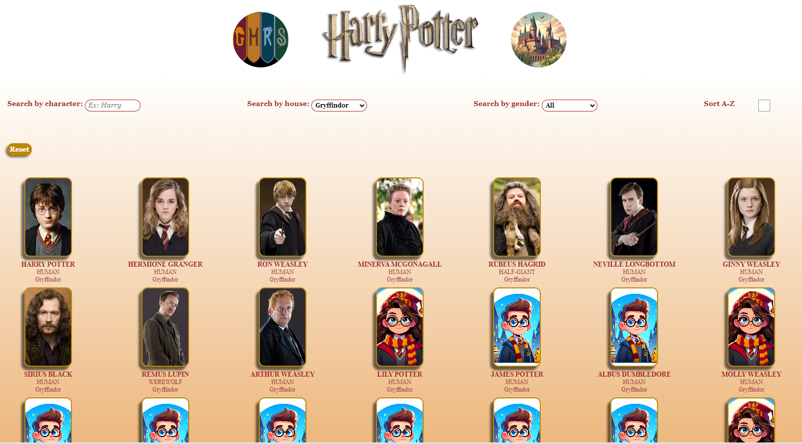
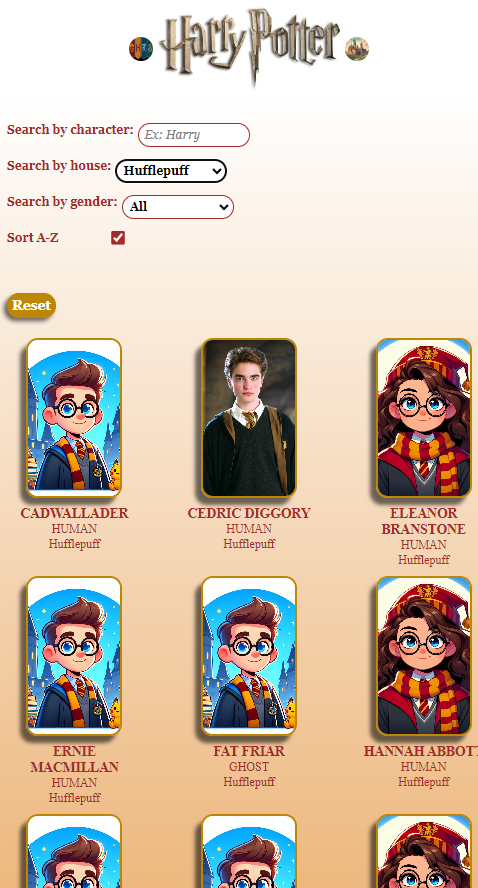
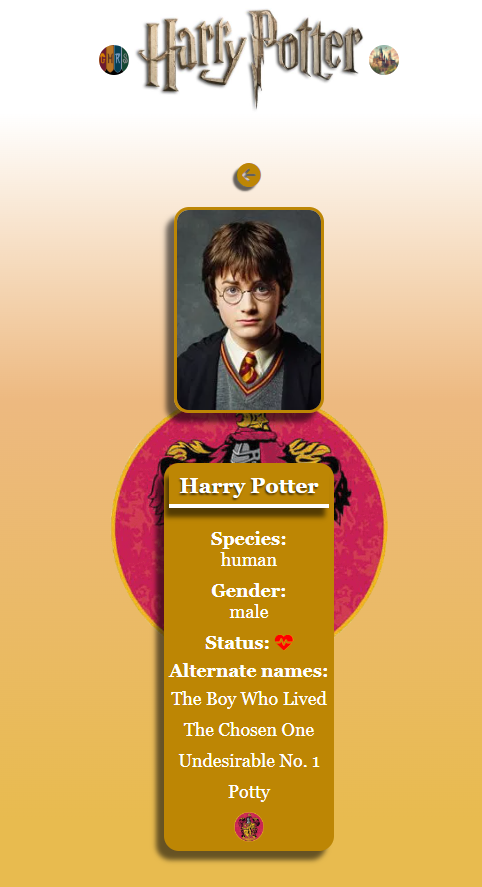

# Buscador de personajes Harry Potter

http://beta.adalab.es/modulo-3-evaluacion-final-natlopar/



Hola! 🙋‍♀️

Este es mi proyecto de evaluación final del tercer módulo de Adalab, correspondiente a **React**.

## Objetivo ✌️

Desarrollar una aplicación web de búsqueda de personajes de la  saga de "Harry Potter" empleando diferentes filtros.


## Funcionalidades ☑️

Las funcionalidades de esta página web son las siguientes:

1. Crear el listado de los personajes con la información obtenida a través de un **API** (https://hp-api.onrender.com/), tras elegir una de las cuatro casas de Hogwarts. Por defecto, se cargarán los de la casa de Gryffindor.
2. Filtrar personajes por su **nombre**.
3.  Añadir una imagen por defecto para los personajes que nos devuelve el API sin imagen.
4. Creación de cuatro componentes como mínimo en nuestra aplicación.
5. Usar rutas y React Router DOM para mostrar el detalle del personaje clicado en un nuevo componente a pantalla completa, con varios detalles de ese personaje.

## Otros detalles a tener en cuenta ⭐

- El campo de texto debe estar recubierto por una etiqueta "form".
- Si estando en el campo de filtrado pulsamos intro debemos impedir que el navegador navegue o cambie
la ruta sin querer.
- Si se busca por un texto por ejemplo "XXX" y no hay ningún personaje que coincida con dicho texto
se debe mostrar un mensaje del tipo 
    >"No hay ningún personaje que coincida con la palabra XXX".
- El filtro debe filtrar independientemente de que la usuaria introduzca el texto en mayúsuclas o
minúsculas.
- Al entrar en el detalle de un personaje y a continuación pulsar atrás, el campo de texto debe mostrar
el texto que tenía anteriormente.


## Bonus de mejoras visuales 🆒

- En el detalle del personaje mostrar la casa con su respectivo emblema y si un personaje está vivo o
muerto con su respectivo icono.
- Usar sistema de grid pintar el listado de personajes.
- Diseño responsive.

## Otros bonus 💫

- En el caso de que la usuaria navegue a una URL
inexistente, debemos mostrar un mensaje del tipo "El personaje que buscas no existe".
- Comtemplar que la URL del detalle de personaje sea compatible, es decir, que si
visitamos esa URL directamente en el navegador se vea el detalle del personaje. Si refescamos el
navegador en el detalle de un personaje (o cerrando y abriendo en la misma dirección) también debe
volver a mostrar el detalle de ese personaje.
- Ordenar el listado alfabéticamente por nombre.
- Añadir un botón de Reset para que la página vuelva a su listado principal.

## Mejoras propias  🪄

Además de implentar los detalles, mejoras y bonus propuestos, he decidido añadir...
- Filtro por **género**.
- Al añadir una **imagen por defecto** cuando obtenemos un personaje sin imagen, que esta sea diferente **en función del género** del mismo.
- La funcionalidad de **ordenar alfabéticamente** se ejecuta al al hacer click en un selector de tipo **checkbox**.
- El **background** de cada personaje, dentro de su página de detalle, se corresponde con el **emblema** de su casa.
- El título del header es un Link para que al hacer clic en él se pueda volver a la ruta principal.

## Tecnologías usadas ⚛️

- HTML
- SCSS
- JavaScript
- React js + Vite
- React Starter Kit
- GitHub Pages


## Maquetación 😍

Es un proyecto desarrollado con Sass y con diseño responsive:


**Mobile**





**Tablet**





## Guía de uso rápido ✔️

Este proyecto ha sido desarrollado con React Starter Kit, que contiene una serie de herramientas pre-configuradas y pre-instaladas para optimizar y organizar el proyecto.

Para poder trabajar con él, tendrás que seguir los siguientes pasos:

- Crea tu repositorio. Copia en la raíz del repositorio todos los archivos de tu proyecto.
- Abre la terminal e instala las siguientes dependencias:


```
npm install

npm install node-sass

npm install react-router-dom
```

Una vez que han sido instaladas, podrás arrancar el proyecto escribiendo en la terminal el siguiente comando:

```
npm run dev
```
Hay que abrir la url generada con Ctrl + Click.


## Estructura de carpetas 🗂️

La estructura de carpetas es similar a esta:

```
src
 ├─ components 
 |  ├─ App.jsx
 |  └─ Filters.jsx
 |  ```
 ├─styles
 |  ├─ core
 |  ├─ layout
 |   App.scss
 ├─services
 |  ├─ api
 |  ├─ localStorage
 └─ images
 └─ main.jsx
```

## Contribución 💡

Agradezco feedback para poder seguir realizando mejoras y no dejar de aprender!!

Muchas gracias por el tiempo dedicado!


## Autora  👩

(https://github.com/natlopar)


